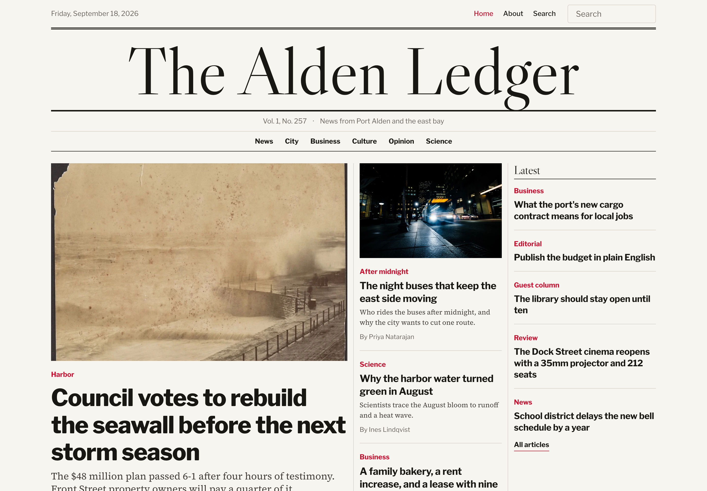

# Masthead

A newspaper-style news theme for [EmDash](https://github.com/emdash-cms/emdash), the CMS built on Astro. Made for editorial teams: many authors, sections, and desks. Rules and hierarchy do the work, not decoration.

[Live demo](https://masthead-free.ondelva.com) · [Admin demo](https://masthead-free.ondelva.com/demo) · [Docs](docs/customization.md) · [Pro demo](https://masthead.ondelva.com) · [Get Pro](https://buy.polar.sh/polar_cl_5QWr1VFC0mYPuUIObySlgyfGa3MYodyZaI3AU0xmwI4)



The admin demo signs you in as a contributor: you can write drafts and upload media, and the demo resets every week.

## Features

- EmDash CMS on Astro 7, server-rendered on Cloudflare Workers with D1 and R2
- Public pages cached at the edge (Workers Caching) and purged when content changes — see [docs/customization.md](docs/customization.md#caching)
- Full admin UI for editors: posts, pages, sections, authors, media
- Front page with a full-width nameplate, dense column grid, and vertical rules
- Single-column article view with bylines, reading time, and a lead-story drop cap
- Category and tag archives, full-text search, RSS, SEO metadata and JSON-LD
- Dark mode, responsive from 360px, no client-side framework on public pages
- `AGENTS.md` included — works out of the box with Claude Code / Cursor

## Quick start

```sh
pnpm create astro@latest my-site --template ondelva/astro-theme-masthead
cd my-site
npx emdash secrets generate --write .env
pnpm dev
```

The `secrets` line creates `EMDASH_ENCRYPTION_KEY` in `.env` (see [docs/deploy.md](docs/deploy.md#secrets)). `git clone` works too.
Open `http://localhost:4321/_emdash/admin` and finish setup. The sample content is applied on first setup.

## Configure

Site title, tagline, logo, menus, and authors are edited in the admin UI, not in code.
Colors and fonts: override tokens in `src/styles/theme.css`; webfonts are set under `fonts:` in `astro.config.mjs`.
See [docs/customization.md](docs/customization.md).

## Requirements

- Node.js 22.12 or later, pnpm 11
- Cloudflare **Workers Paid** plan (the bundle is over the 3 MiB free-plan limit)
- Tested with emdash 0.38.x. Dependencies are pinned to exact versions; EmDash is in beta and ships weekly.

## Local development

```sh
pnpm install
pnpm dev
```

`pnpm reset` wipes the local D1 database and R2 uploads, then starts the dev server so setup (and the seed) runs again.

## Deploy

Create the R2 bucket first (`wrangler r2 bucket create masthead-media`); `wrangler deploy` does not create it.

```sh
pnpm deploy
```

Finish setup immediately after the first deploy: until an admin account exists, the setup page is public.
See [docs/deploy.md](docs/deploy.md).

## Free vs Pro

This is the free, MIT-licensed edition. Masthead Pro is built on the same code and adds the following ([Pro demo](https://masthead.ondelva.com)):

|            | Free                                                   | Pro                                                    |
| ---------- | ------------------------------------------------------ | ------------------------------------------------------ |
| Pages      | Home, articles, sections, tags, authors, search, legal | + Podcast, page layouts (Cover, Sign-up)               |
| Podcast    | –                                                      | Episodes, player, Apple/Spotify-ready RSS feed         |
| Membership | –                                                      | Email-link sign-in, members-only articles and episodes |
| Forms      | –                                                      | Newsletter and corrections forms                       |
| Front page | Lead, top stories, section columns set in the admin    | + Podcast strip                                        |
| OG images  | –                                                      | Generated per article                                  |
| Support    | GitHub Issues                                          | Email (im@ondelva.com), 2 business days                |

[See the Pro demo →](https://masthead.ondelva.com) · [Get Pro →](https://buy.polar.sh/polar_cl_5QWr1VFC0mYPuUIObySlgyfGa3MYodyZaI3AU0xmwI4)

## License

[MIT](LICENSE).
Third-party assets: [THIRD-PARTY-NOTICES.md](THIRD-PARTY-NOTICES.md)
